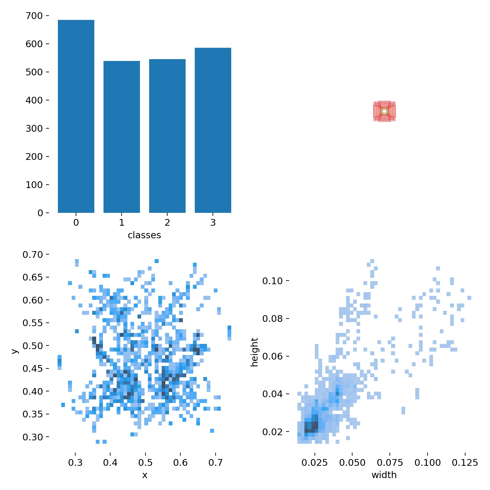

1. The Original data contains 200 patients' MRI images and its annotations.
  * 4 labels: Absence of signal, Moderate stenosis, Occlusion, and Severe stenosis.
  * data format: VOC.
  * we select 2815 images with xml files, including 727 Absence of signal images and its xnl, 841 Moderate stenosis images and its xnl, 657 Occlusion images and its xnl, and 668 Severe stenosis images and its xnl.
  * Then we split taining set and testing set mannually to ensure a balanced distribution of labels.
    * Training set(180 patients): Absence of signal(650), Moderate stenosis(760), Occlusion(609), and Severe stenosis(598).
    * Testing set(20 patients): Absence of signal(77), Moderate stenosis(81), Occlusion(48), and Severe stenosis(70).

